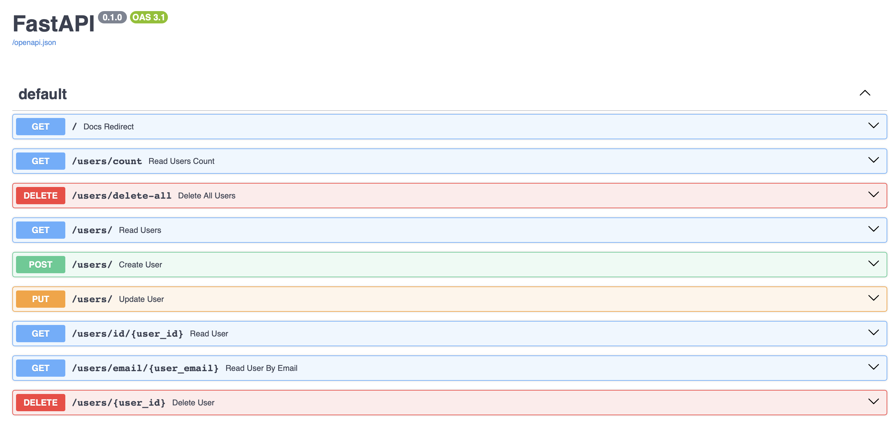
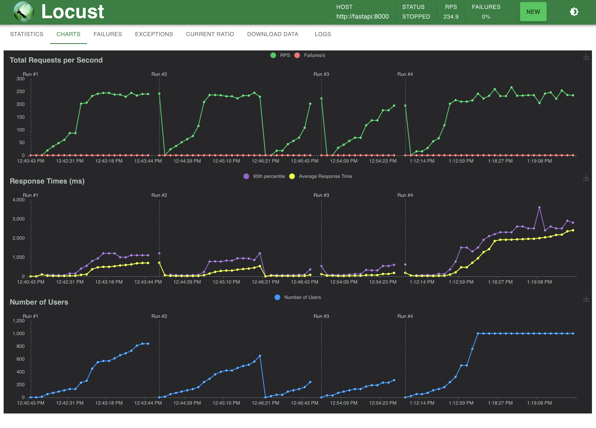
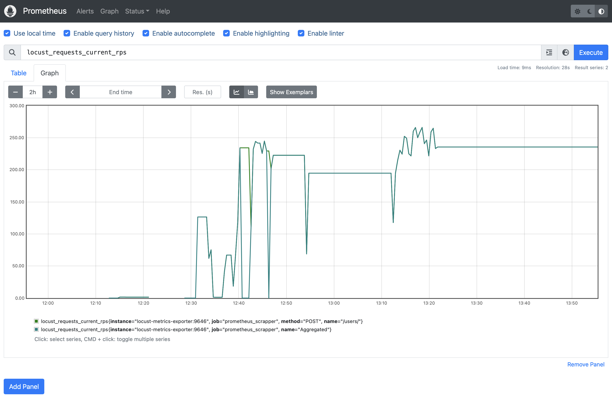
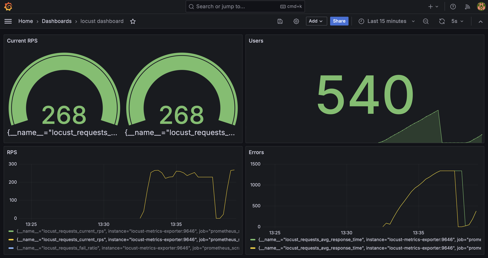

# Database APIs: testing and monitoring

I made a simple FastAPI project to test local SQLAlchemy Database APIs using Locust library. Performance metrics are stored long-term via Prometheus time-series database and monitored via Grafana. The whole thing was shockingly easy to write and set up in a few hours (huge thanks to Docker compose too), and the setup is ready for production too. Icreadible.

Screenshots of four webapps running on four ports: FastAPI, Locust, Prometheus, and Grafana.

|  |  |
|-------------------------------|-------------------------------|
|  |  |

<!-- 


 -->

## Description 

Let me first describe the tools I used:
- **[FastAPI](https://fastapi.tiangolo.com)** is a modern, fast (high-performance), **web framework for building APIs** based on standard Python type hints. It's built on top of standard Python libraries and tools, including Starlette for the web parts and Pydantic for the data parts.
- **[Locust](https://locust.io)** is an performance/load testing tool for HTTP and other protocols. Its developer friendly approach lets you define your tests in regular Python code.
- **[Prometheus](https://prometheus.io)** is a monitoring system with a focus on reliability, designed for capturing time-series data like metrics. It supports powerful queries, visualization, precise alerting, and has a strong ecosystem for service discovery and external storage integrations.
- **[Grafana](https://grafana.com)** is an analytics and interactive visualization web application that provides charts, graphs, and alerts for the web when connected to supported data sources, like Prometheus. It's widely used for monitoring metrics and data visualization across various environments, including cloud infrastructure and applications.

## Run the FastAPI app

Prerequisites for those with no Docker:
```bash
pip install -r requirements.txt
```

Start ASGI server:
```bash
fastapi run
```

Once your server is running, you can access the Swagger UI by navigating to:
```url
localhost:8000/docs   # eq. http://127.0.0.1:8000/docs
```
in your web browser. This `/docs` route is provided by FastAPI automatically and doesn't refer to a physical directory in your project; it's a virtual endpoint that FastAPI provides when the server is running.

# Run load testing using Locust

```python
locust --host http://localhost:8000
# or to define how many CPUs to run on:
locust --processes 8
```
Then check:
```url
http://localhost:8089
```

## Scaling with Prometheus and Grafana 

Inspired by (Yusuf Tayman's blog)[https://medium.com/devopsturkiye/locust-real-time-monitoring-with-grafana-66654bb4b32].

In order to preserve any metrics long-term we:
- add Prometheus as a time-series DB
- add Grafana for visualization
- scale using docker-compose


Docker-compose makes running several services straightforward:
```bash
docker-compose up
```

Notable points:
- mount volumes instead of copying as any changes to local files will be reflected in the container immediately:
```
 volumes:
      - .:/app
```
- each container is accessible to other containers within the same Docker Compose network using the service names as hostnames, for example:
LOCUST_HOST=http://fastapi:8000
- to control how many CPUs you want to use for locust testing use `--processes X` (X=-1 means use all).
- 'ro' stands for read-only
- use `volume` to persist all the data even if the container is stopped, check all volumes with `docker volume ls`
